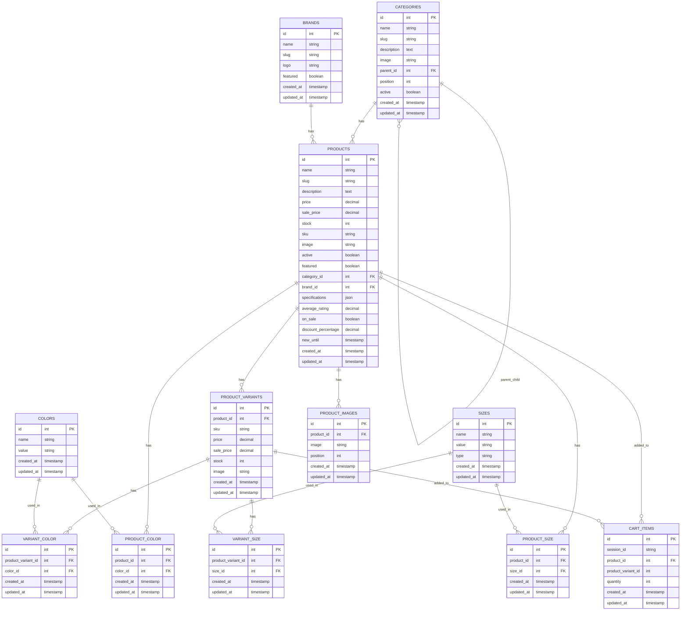

# E-Commerce Database Schema

This repository contains the Entity-Relationship Diagram (ERD) for an e-commerce platform, designed using Mermaid.js.

## How to Run the Application

### Prerequisites

Ensure you have the following installed:

-   PHP (latest version recommended)
-   Composer
-   MySQL
-   XAMPP (if running locally)
-   Laravel framework
-   Node.js & npm (for frontend dependencies, if applicable)
-   Redis (if needed)

### Installation Steps

1. **Clone the Repository**

    ```sh
    git clone https://github.com/Ahmed-AESoliman/odlica.git
    cd odlica
    ```

2. **Install Dependencies**

    ```sh
    composer install
    npm install
    ```

3. **Set Up Environment Variables**
   Copy the `.env.example` file and rename it to `.env`, then configure the database and other settings:

    ```sh
    cp .env.example .env
    ```

    Open `.env` and update the following:

    ```ini
    DB_CONNECTION=mysql
    DB_HOST=127.0.0.1
    DB_PORT=3306
    DB_DATABASE=
    DB_USERNAME=root
    DB_PASSWORD=
    ```

    If you need to enable Redis for caching and session storage, update the following:

    ```ini
    CACHE_DRIVER=redis
    SESSION_DRIVER=redis
    ```

    number of products need to be seeding

    ```ini
     SEED_PRODUCTS_COUNT=1000000
    ```

4. **Generate Application Key**

    ```sh
    php artisan key:generate
    ```

5. **Run Database Migrations and Seed Data**

    ```sh
    php artisan migrate --seed
    ```

6. **Start the Development Server**
    ```sh
    php artisan serve
    ```
    The application should now be running at `http://127.0.0.1:8000`.

## Database Schema

The database schema is represented using Mermaid.js:



## Conclusion

This repository provides a structured database schema for an e-commerce platform. If you encounter any issues, feel free to contribute or open an issue in the repository.
